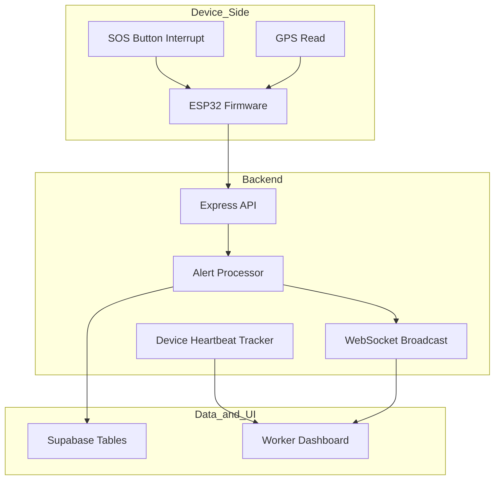
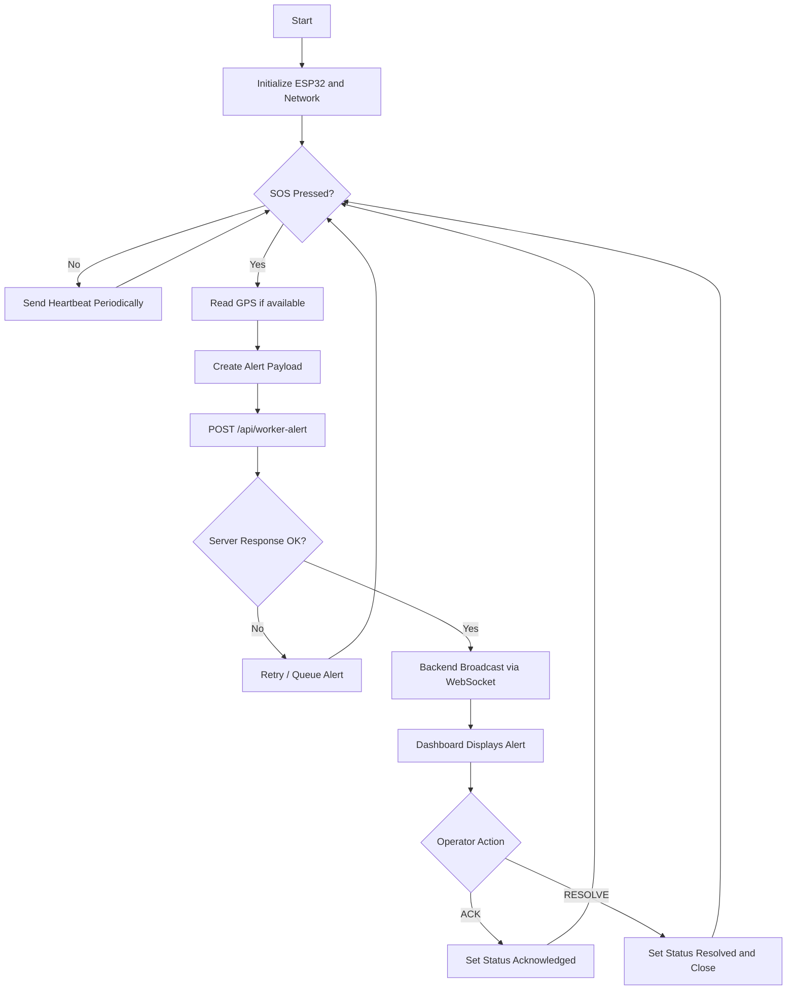

# SATEY Worker Safety Alert System

Real-time industrial worker safety platform using ESP32 SOS devices, Node.js backend, WebSocket streaming, Supabase worker profiles, and live map monitoring.

## Project Title Display

**Project Name:** SATEY Worker Safety Alert System  
**Domain:** Industrial Safety / Emergency Response  
**Current Deployment Mode:** Wi-Fi or LAN prototype  
**Target Real-World Deployment:** LoRa-enabled long-range emergency network

## Working Demonstration

### Demo Scenario

1. Start server and open dashboard.
2. Worker presses SOS button on ESP32 device.
3. ESP32 sends alert packet to backend API.
4. Backend enriches alert with worker profile details from Supabase.
5. Dashboard receives live alert through WebSocket.
6. Alert appears on map and in bottom SOS strip.
7. Control room operator clicks `ACK` or `RESOLVE`.

### Run Steps

```bash
npm install
npm start
```

Open:

```text
http://localhost:3000/worker-dashboard.html
```

### ESP32 Setup Snippet

```cpp
#define WIFI_SSID "YOUR_WIFI"
#define WIFI_PASSWORD "YOUR_PASSWORD"
#define SERVER_URL "http://YOUR_PC_IP:3000"
#define WORKER_ID "worker-unique-id"
```

## Technical Explanation

### 1) Edge Device Layer (ESP32)

- Reads SOS button state.
- Optionally captures GPS coordinates.
- Sends HTTP POST request to `/api/worker-alert`.
- Sends periodic heartbeat to `/api/device-heartbeat` for online status tracking.

### 2) Backend Layer (Node.js + Express + WebSocket)

- Receives alert payload and validates required fields.
- Fetches worker data from Supabase `emergency_profiles`.
- Creates enriched alert object with status lifecycle:
  - `active`
  - `acknowledged`
  - `resolved`
- Broadcasts updates to all connected dashboard clients via WebSocket.
- Maintains in-memory lists of active alerts and connected devices.

### 3) Data Layer (Supabase)

- `emergency_profiles`: worker master data.
- Optional `worker_sos_alerts`: incident history for analytics and reporting.

### 4) Frontend Layer (Dashboard)

- Displays:
  - Active SOS cards
  - Device online/offline list
  - Map markers for alert location
- Provides operational actions:
  - `ACK` to mark incident as seen
  - `RESOLVE` to close incident

## Components List

### Hardware Components

1. ESP32 development board
2. Push button (SOS trigger)
3. GPS module (optional, recommended)
4. LED/Buzzer for local feedback (optional)
5. Battery + charging module
6. Enclosure and wiring

### Software Components

1. Node.js runtime
2. Express server
3. WebSocket (`ws`) for live updates
4. Supabase for worker profile and history storage
5. HTML/CSS/JavaScript dashboard with Leaflet map

## Cost Estimation

### Per Worker Device (Prototype)

| Item | Approx Cost (INR) |
|---|---:|
| ESP32 board | 350 - 600 |
| SOS button + passive parts | 30 - 80 |
| GPS module | 500 - 900 |
| Battery + charger | 250 - 500 |
| Enclosure + wiring | 150 - 300 |
| Assembly/misc | 100 - 200 |
| **Total (with GPS)** | **1380 - 2580** |

### Shared Infrastructure

| Item | Approx Cost (INR) |
|---|---:|
| Router / local networking | 1500 - 3000 |
| Server host (if cloud) | 300 - 1500 / month |
| Supabase | Free tier initially, paid on scale |

## Future Scope

### Planned Upgrade: LoRa Instead of LAN

1. Replace Wi-Fi/LAN communication with LoRa radio packets from worker devices.
2. Use one or more LoRa gateways to aggregate device data and forward to backend.
3. Improve battery life using low-power duty cycles and heartbeat scheduling.
4. Increase coverage for mines, plants, tunnels, and remote outdoor sites.
5. Add multi-hop/redundant gateway strategy for fault tolerance.

### Product Expansion

1. Geo-fencing and hazard-zone warnings.
2. Escalation workflow (if unacknowledged for X minutes).
3. SMS/WhatsApp/voice call integrations.
4. Incident analytics dashboard (heatmap, response SLA, MTTR).
5. Offline buffering and retransmission for weak-signal conditions.

## Block Diagram

```mermaid
flowchart LR
    A[Worker Unit\nESP32 + SOS Button + GPS] --> B[Network Layer\nWi-Fi/LAN (Prototype)]
    B --> C[Node.js Alert Server\nREST + WebSocket]
    C --> D[Supabase\nWorker Profile + Alerts]
    C --> E[Control Room Dashboard\nMap + SOS Cards + Actions]
```

## Circuit Diagram / Architecture

### Hardware Wiring (Typical)

- SOS Button:
  - One pin -> `GPIO13`
  - Other pin -> `GND`
  - Internal pull-up enabled in firmware
- Status LED (optional):
  - Anode -> `GPIO5` through resistor
  - Cathode -> `GND`
- GPS Module (optional):
  - `VCC` -> `3.3V`
  - `GND` -> `GND`
  - `TX` -> ESP32 `RX`
  - `RX` -> ESP32 `TX`

### System Architecture



## Flowchart



## Live Data / Real-Time Results

### Sample Incoming Alert Payload

```json
{
  "worker_id": "58788297-ff08-45a8-8894-2caced2ca9dd",
  "alert_type": "SOS",
  "latitude": 17.4435,
  "longitude": 78.3772,
  "timestamp": 1734582310,
  "status": "active"
}
```

### Sample Runtime Logs

```text
Worker Safety Dashboard Initializing...
Map Initialized
Connected to Alert Server
New Alert: { id: "...-273210", worker_id: "...", alert_type: "SOS", latitude: 17.4435, longitude: 78.3772 }
```

### Sample API Test

```bash
curl -X POST http://localhost:3000/api/worker-alert \
  -H "Content-Type: application/json" \
  -d "{\"worker_id\":\"test-worker\",\"alert_type\":\"SOS\",\"latitude\":17.4435,\"longitude\":78.3772,\"timestamp\":123456,\"status\":\"active\"}"
```

## Project Structure

```text
server.js
worker-dashboard.html
esp32.i
index.html
emergency-profile.html
helplines.html
css/style.css
js/app.js
js/map.js
js/supabase.js
js/helplines.js
package.json
```

## Environment Variables

```env
SUPABASE_URL=https://your-project.supabase.co
SUPABASE_ANON_KEY=your_anon_key
PORT=3000
```

## Database Schema (Minimum)

```sql
CREATE TABLE emergency_profiles (
  id UUID PRIMARY KEY,
  full_name TEXT,
  contact_1 TEXT,
  blood_group TEXT
);
```

## Conclusion

The current implementation successfully demonstrates a complete end-to-end safety response chain: **trigger -> transmit -> process -> visualize -> act**. With LoRa integration, this project can evolve from a LAN-bound prototype into a practical, long-range industrial safety product.
